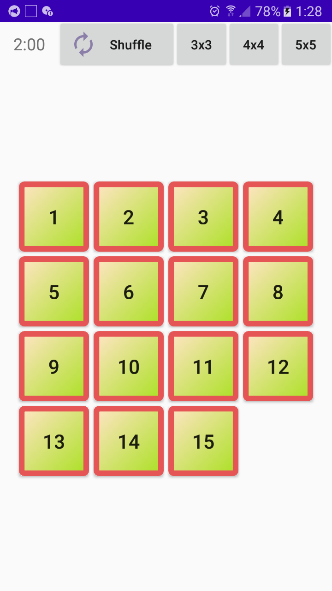

# 15 Puzzle

Простая игра в пятнашки.

Создана с целью изучить возможности анимации движения, изменения цвета, градиентов в Android.

Изначально игра была написана на Delphi 10.2 на кроссплатформенной библиотеке FireMonkey: https://github.com/GeorgeBobrov/15Puzzle.Delphi

Далее она была портирована на [Qt](https://github.com/GeorgeBobrov/15Puzzle.Qt), [JS](https://github.com/GeorgeBobrov/15Puzzle.JS), [Java](https://github.com/GeorgeBobrov/15Puzzle.Java) и наконец Kotlin.

В Kotlin-версии был добавлен красивый эффект перемешивания пятнашек на корутинах (в JS-версии он также реализован на async-await).

 

Два нижних ряда кнопок на скриншоте - для проверки всех анимаций при отладке, вообще должны быть скрыты.

JS-версию игры можно попробовать прямо в браузере:
http://georgebobrov.github.io/15Puzzle.JS/